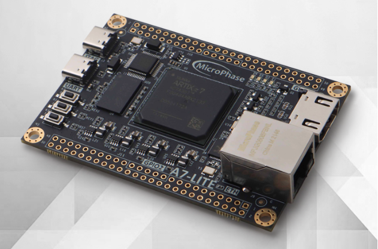

这是MicroPhase的A7-Lite开发板（见下图）的FPGA工程，使用的是Vivado开发环境（非工程模式）。



- constrs：包含约束文件
- dosc：主要包括板子的原理图
- scripts：tcl脚本

fpga_cmod_a7_2p_top.v是工程的顶层文件。

1.生成FPGA比特（bit）文件，在本目录下执行以下指令：

```
make
```

即可在out目录下生成fpga_cmod_a7_2p_top.bit文件。

使用[openFPGAloader](https://github.com/trabucayre/openFPGALoader)下载bit文件到FPGA。

2.下载bit文件到FPGA RAM（掉电易失）

```
openFPGALoader -b alinx_ax7101 -c ft232 -r fpga_cmod_a7_2p_top.bit
```

3.固化bit文件到FPGA flash（掉电不易失）

```
openFPGALoader -b alinx_ax7101 -c ft232 -f -r fpga_cmod_a7_2p_top.bit
```

