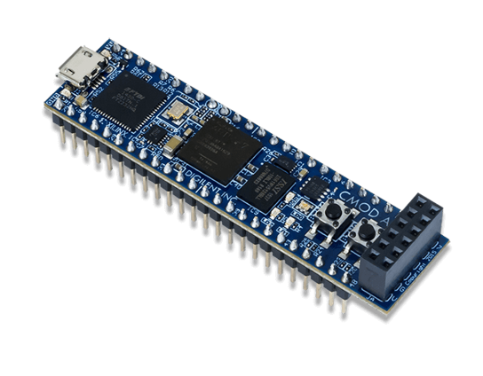

这是Digilent的Cmod A7开发板（见下图）的FPGA工程，使用的是Vivado开发环境（非工程模式）。



- constrs：包含约束文件
- dosc：主要包括板子的原理图
- scripts：tcl脚本

fpga_cmod_a7_top.v、fpga_cmod_a7_2p_top.v分别是单Master口（指令总线和数据总线共用）和双Master口（指令总线和数据总线独立）工程的顶层文件。

目前开发主要集中在双Master口工程。

1.生成FPGA比特（bit）文件，在本目录下执行以下指令：

```
make -f Makefile.2p
```

即可在out目录下生成fpga_cmod_a7_2p_top.bit文件。

使用[openFPGAloader](https://github.com/trabucayre/openFPGALoader)下载bit文件到FPGA。

2.下载bit文件到FPGA RAM（掉电易失）

```
openFPGALoader -b cmoda7_35t -r fpga_cmod_a7_2p_top.bit
```

3.固化bit文件到FPGA flash（掉电不易失）

```
openFPGALoader -b cmoda7_35t -f -r fpga_cmod_a7_2p_top.bit
```

